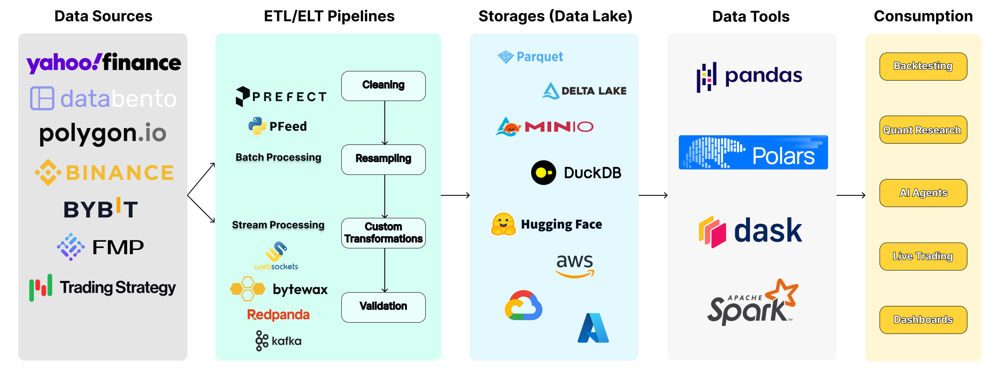

# `pfeed`: The Single Source of Truth for Algo-Trading Data. Uniting Traders to Clean Once & Share with All.

[](https://discord.gg/vqpS94tpdp)
[](https://x.com/pfund_ai)
[](https://pepy.tech/project/pfeed)
[](https://pypi.org/project/pfeed)

[](https://afterpython.org)
[](https://github.com/PFund-Software-Ltd/pfeed/discussions)
[](https://deepwiki.com/PFund-Software-Ltd/pfeed)
[](https://codewiki.google/github.com/pfund-software-ltd/pfeed?utm_source=badge&utm_medium=github&utm_campaign=github.com/pfund-software-ltd/pfeed)
<!-- [](https://badge.fury.io/py/pfeed) -->
<!--  -->
<!--  -->
<!-- [](https://jupyterbook.org) -->
<!-- [](https://python-poetry.org/) -->

[MinIO]: https://min.io/
[DeltaLake]: https://github.com/delta-io/delta-rs
[pfund]: https://github.com/PFund-Software-Ltd/pfund
[Polars]: https://github.com/pola-rs/polars
[Dask]: https://www.dask.org/
[Spark]: https://spark.apache.org/docs/latest/api/python/index.html
[pytrade]: https://pytrade.org
[Yahoo Finance]: https://github.com/ranaroussi/yfinance
[Bybit]: https://public.bybit.com
[CryptoHFTData]: https://cryptohftdata.com
[Binance]: https://data.binance.vision
[OKX]: https://www.okx.com/data-download
[Databento]: https://databento.com/
[Polygon]: https://polygon.io/
[FirstRate Data]: https://firstratedata.com
[Prefect]: https://www.prefect.io/
[Daft]: https://www.daft.ai/
[Hyperliquid]: https://app.hyperliquid.xyz/trade
[FinancialModelingPrep]: https://financialmodelingprep.com/
[DuckDB]: https://duckdb.org/
[LanceDB]: https://lancedb.com/
[Vortex]: https://vortex.dev/
[DuckLake]: https://github.com/duckdb/ducklake
[Iceberg]: https://iceberg.apache.org/

## TL;DR: use pfeed to manage your trading data; other traders will help you clean it



> For illustration purposes only, not everything shown is currently supported.

## Problem
Starting algo-trading requires reliable and clean data, but traders often **work in silos**, each writing **duplicated code** to clean the same datasets—wasting time and effort. Accessing clean, ready-to-use data is a challenge, forcing traders to handle tedious data tasks before they can even start trading.

## Solution
`pfeed` leverages modern data engineering tools to centralize data cleaning efforts, automate ETL/ELT, store data in a **data lake with DeltaLake** support, and output **backtesting-ready data**, allowing traders to focus on strategy development.

---
`pfeed` (/piː fiːd/) is the data engine for trading, serving as a pipeline between raw data sources and traders. It enables you to **download historical data**, **stream real-time data**, and **store cleaned data** in a **local data lake for quantitative analysis**, supporting both **batch processing** and **streaming** workflows through streamlined data collection, cleaning, transformation, and storage.

## Core Features
- [x] Download or stream reliable, validated and **clean data** for research, backtesting, or live trading
- [x] Get historical data (**dataframe**) or live data in standardized formats by just calling a **single** function
- [x] **Own your data** — store locally now, write directly to the cloud later
- [x] Build a local data lakehouse (Parquet + [DeltaLake]) on your own machine
- [x] Interact with different kinds of data (including TradFi, CeFi and DeFi) using a **unified interface**
- [x] Scale using modern data tools (e.g. [Polars], [Daft]) and workflow orchestration frameworks ([Prefect] for batch processing)

---

<details>
<summary>Table of Contents</summary>

- [Installation](#installation)
- [Quick Start](#quick-start)
    - [Download Historical Data](#1-download-historical-data)
    - [Retrieve Downloaded Data](#2-retrieve-downloaded-data)
    - [Stream Live Data](#3-stream-live-data)
- [Supported Data Storages](#supported-data-storages)
- [Supported IO Formats](#supported-io-formats)
- [Supported Data Sources](#supported-data-sources)
- [Related Projects](#related-projects)
- [Disclaimer](#disclaimer)

</details>


## Installation
> For more installation options, please refer to the [documentation](https://pfeed.pfund.ai/doc/installation).
```bash
# [RECOMMENDED]: Core Features, including Ray, ZeroMQ, DeltaLake, etc.
pip install "pfeed[core,yfinance]"
```


## Quick Start
> Want to try first? Run `pfeed` in your browser — no install needed — at
 **[pfeed.pfund.ai](https://pfeed.pfund.ai/)**.
```python
import pfeed as pe

bybit = pe.Bybit()  # initialize data client
feed = bybit.market_feed  # this could be {data_source}.news_feed if the data source supports it
```

### 1. Download Historical Data
Download data from Bybit and get a standardized dataframe
```python
result = feed.download(
    product='BTC_USDT_PERP',  # or BTC_USDT_PERPETUAL in full
    resolution='1minute',  # '1tick'/'1t' or '2second'/'2s' etc.
    start_date='2026-01-01',
    end_date='2026-01-01',
    storage_config=pe.StorageConfig(storage='LOCAL'),  # store data locally
)
df = result.data.collect()  # polars dataframe by default
```

CryptoHFTData can supply exchange-specific historical crypto trades through the
same feed API. PFeed can return ticks directly or resample them into bars:
```bash
pip install "pfeed[cryptohftdata]"
```

```python
import pfeed as pe

result = pe.CryptoHFTData().market_feed.download(
    product="BTC_USDT_PERP",
    exchange="binance_futures",
    symbol="BTCUSDT",
    resolution="1m",
    start_date="2024-07-13",
    end_date="2024-07-13",
)
bars = result.data.collect()
```


### 2. Retrieve Downloaded Data
Retrieve downloaded data from storage
```python
result = feed.retrieve(
    product='BTC_USDT_PERP',
    resolution='1m',  # 1-minute data
    start_date='2026-01-01',
    end_date='2026-01-01',
    storage_config=pe.StorageConfig(storage='LOCAL'),
)
df = result.data.collect()
```


### 3. Stream Live Data
Get streaming data from Bybit
```python
feed.stream(
    product='BTC_USDT_PERP',
    resolution='1tick',  # or just 'tick' for tick data
    callback=lambda ws_name, msg: print(ws_name, msg),
)
```


## Supported Data Storages
| Storage                | Status |
| ---------------------- | ------ |
| LOCAL/CACHE            | 🟢     |
| [DuckDB]               | 🟢     |
| [LanceDB]              | 🟢     |
| HuggingFace            | 🟢     |
| S3                     | 🔴     |
| PostgreSQL/TimescaleDB | 🔴     |


## Supported IO Formats
| IO Format   | Status |
| ----------- | ------ |
| Parquet     | 🟢     |
| [DeltaLake] | 🟢     |
| [DuckLake]  | 🔴     |
| [Iceberg]   | 🔴     |
| [Vortex]    | 🔴     |


## Supported Data Sources
| Data Source          | Data Categories | Download Historical Data | Stream Live Data |
| -------------------- | --------------- | ------------------------ | ---------------- |
| [Yahoo Finance]      | Market Data, News Data, Fundamental Data     | 🟢                       | 🟢               |
| [Bybit]              | Market Data     | 🟢                       | 🟢               |
| [CryptoHFTData]      | Historical Crypto Market Data | 🟢             | ⚪               |
| *Interactive Brokers | Market Data     | ⚪                        | 🔴               |
| [OKX]                | Market Data     | 🔴                       | 🔴               |
| [Binance]            | Market Data     | 🔴                       | 🔴               |
| [Hyperliquid]        | Market Data     | 🔴                       | 🔴               |
| *[Databento]         | Market Data     | 🔴                       | 🔴               |
| *[FinancialModelingPrep] | Market Data, News Data, Fundamental Data     | 🔴                       | 🔴               |
| *[FirstRate Data]    | Market Data     | 🔴                       | ⚪                |
| *[Polygon]           | Market Data     | 🔴                       | 🔴               |

🟢 = finished \
🟡 = in progress \
🔴 = todo \
⚪ = not applicable \
\* = paid data


## Related Projects
- [pfund] — A Complete Algo-Trading Framework for Machine Learning, TradFi, CeFi and DeFi ready. Supports Vectorized and Event-Driven Backtesting, Paper and Live Trading
- [pytrade] - A curated list of Python libraries and resources for algorithmic trading.


## Disclaimer
THE SOFTWARE IS PROVIDED "AS IS", WITHOUT WARRANTY OF ANY KIND, EXPRESS OR IMPLIED, INCLUDING BUT NOT LIMITED TO THE WARRANTIES OF MERCHANTABILITY, FITNESS FOR A PARTICULAR PURPOSE, AND NONINFRINGEMENT. IN NO EVENT SHALL THE AUTHORS OR COPYRIGHT HOLDERS BE LIABLE FOR ANY CLAIM, DAMAGES, OR OTHER LIABILITY, WHETHER IN AN ACTION OF CONTRACT, TORT OR OTHERWISE, ARISING FROM, OUT OF, OR IN CONNECTION WITH THE SOFTWARE OR THE USE OR OTHER DEALINGS IN THE SOFTWARE.

This framework is intended for educational and research purposes only. It should not be used for real trading without understanding the risks involved. Trading in financial markets involves significant risk, and there is always the potential for loss. Your trading results may vary. No representation is being made that any account will or is likely to achieve profits or losses similar to those discussed on this platform.

The developers of this framework are not responsible for any financial losses incurred from using this software. This includes but not limited to losses resulting from inaccuracies in any financial data output by PFeed. Users should conduct their due diligence, verify the accuracy of any data produced by PFeed, and consult with a professional financial advisor before engaging in real trading activities.
